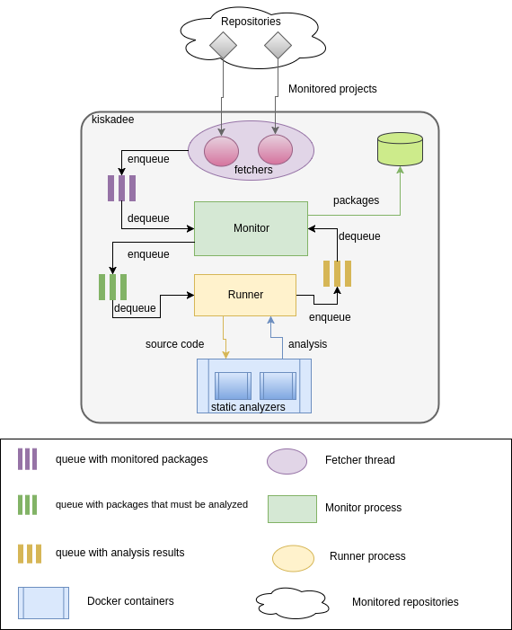

Architecture
=====================

Kiskadee architecture aims to decouple the analysis part, from the monitoring part.
To accomplish that we have separated the component responsible to fetch
informations (version and source) about packages, and the component responsible to
run the analysis. The communication between then is made by queues, as show on
Figure One.

On the current kiskadee architecture, we have three queues. One used by the 
fetchers, called *packages_queue*, to queue packages that should be analyzed.
This queue is consumed by the monitor component, to check if the enqueued
package was not analyzed. The second queue, called *analysis_queue*,
is consumed by the runner component, in order to receive from monitor,
packages that must be analyzed.
If a dequeued package not exists on the database, the monitor component will
send it for analysis using the *analysis_queue* queue. When a analysis is made,
the runner component send the analysis back to the monitor component, using
the *results_queue* queue.
The package (and the analysis) will be saved, by the monitor, on database.
Currently, kiskadee only generate analysis for projects implemented in C/C++,
and this was a scope decision made by the kiskadee community.

..

*Figure One: Kiskadee architecture.*
